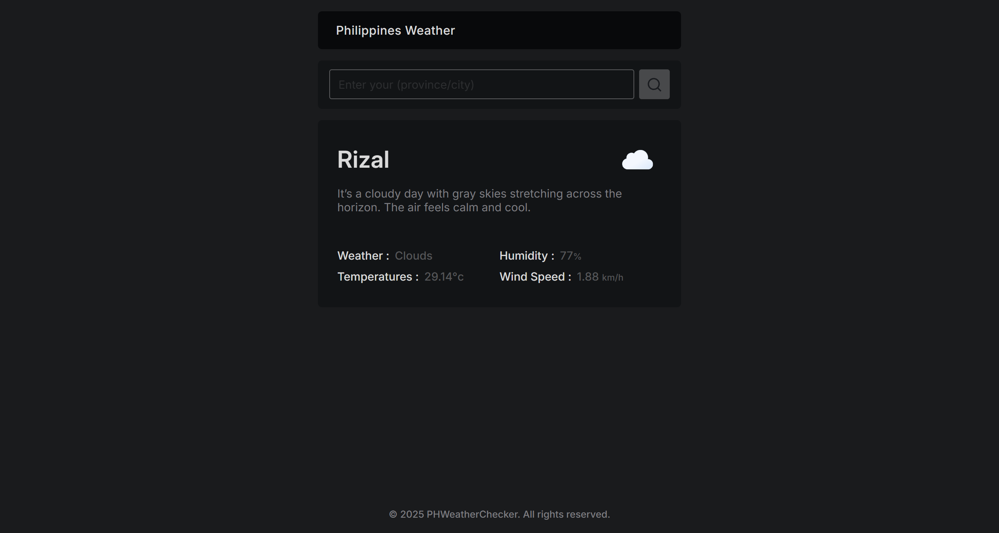

# WeatherPH ☀️🌧️

WeatherPH is a simple web app that shows real-time weather updates for locations across the Philippines.  
It displays temperature, humidity, wind speed, and a weather icon that changes based on the time of day (day/night).

## Features
- Live weather data
- Dynamic icons for day and night
- Simple and clean UI
- Location-based weather search

## Screenshot

## How to Use
1. Enter a Philippine city or province.
2. Click the search icon.
3. View the weather details instantly!

## Technologies
- HTML
- CSS
- JavaScript (Fetch API)

## License
This project is for learning and personal use.
